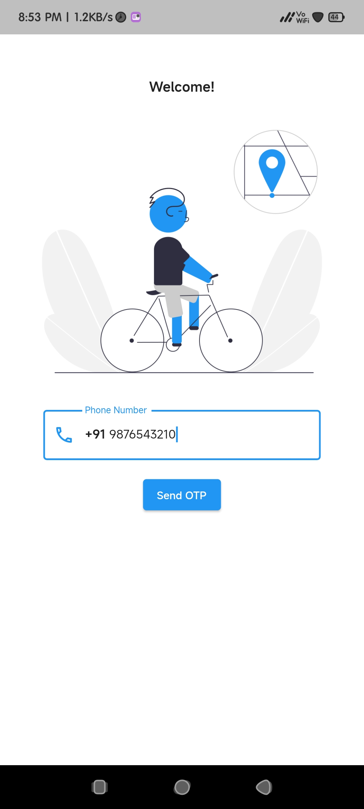
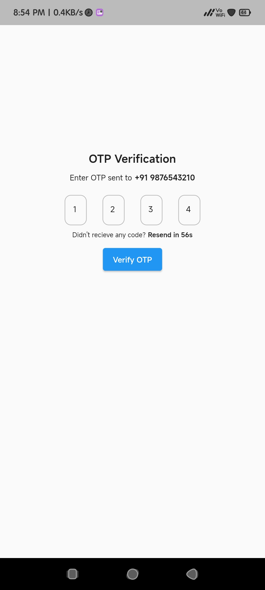
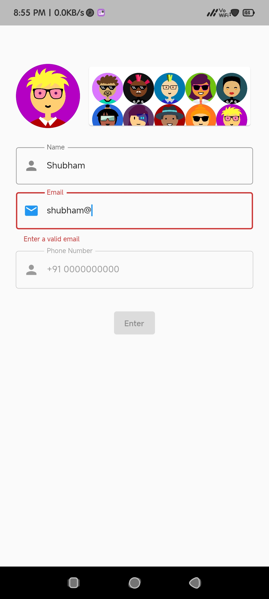
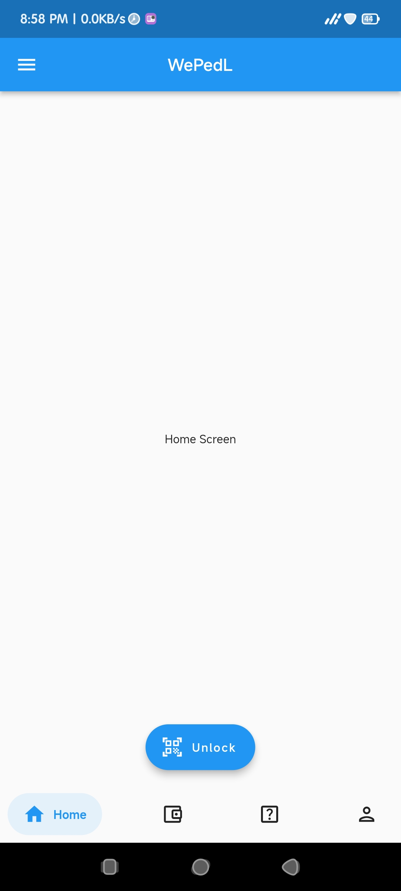
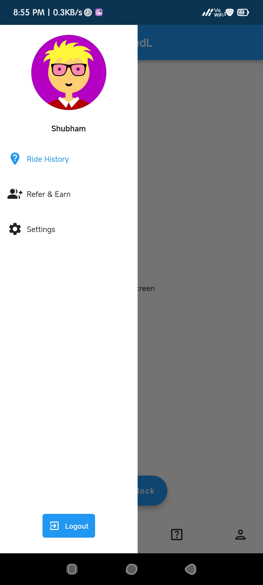

# WePedL - Public Bicycle Sharing Android Application

WePedL is a Public Bicycle Sharing Android app built using flutter and firebase.
Using this app users can register with phone number, recharge wallet, scan qr code on bicycle to unlock it and rent it.


## Run Locally

Clone the project

```bash
  git clone https://github.com/shubham-indalkar/public-bicycle-sharing.git
```

Go to the project directory

```bash
  cd public-bicycle-sharing
```

Install dependencies

```bash
  flutter pub get
```

Run the application

```bash
  flutter run lib/main.dart
```


## Usage/Examples

There will be two branches:
        
    1. main - store locally using shared preferences
        ~ Use any random digits for phone number and otp to login.
        ~ Use phone number '0000000000' and random digits otp to register.
    2. firebase - firebase integration
        ~ Work in progress


## Screenshots













